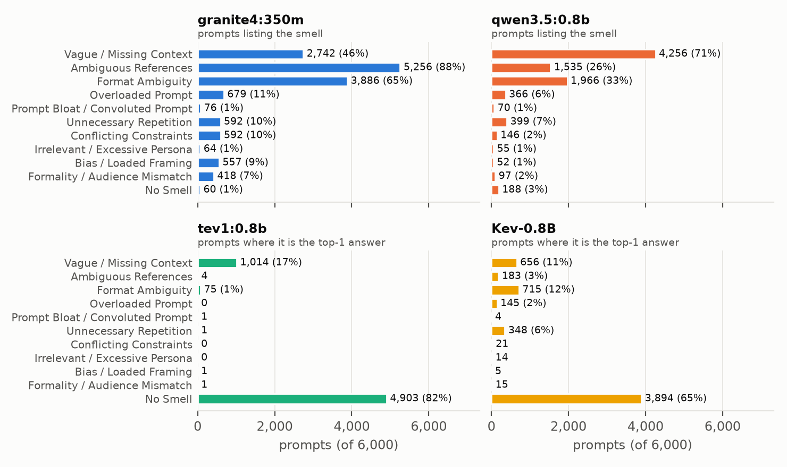
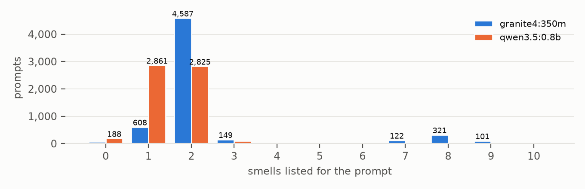
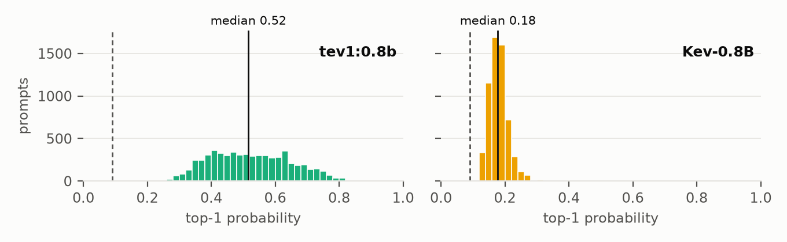
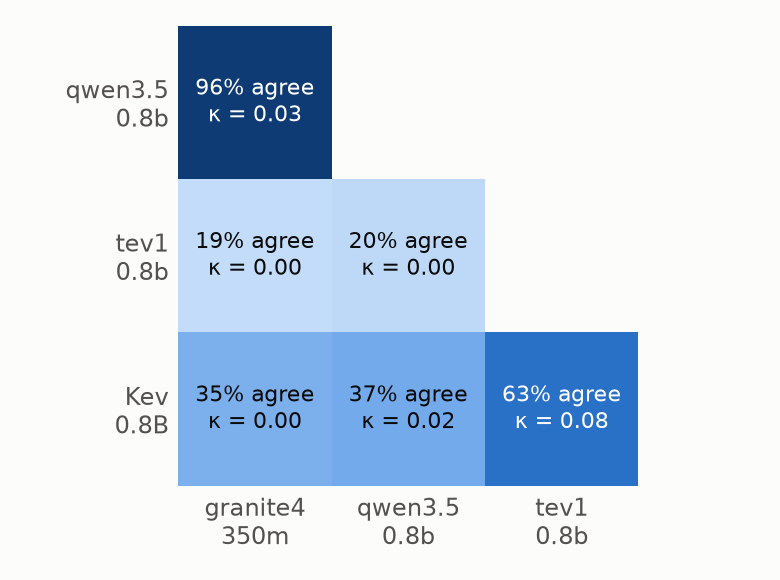

# Prompt-Smell Labels from Four Small Language Models on 6,000 WildChat Prompts

**Author:** Akib Hasan · **Version:** 1.0 (2026-10-03) · **DOI:** [10.5281/zenodo.23119483](https://doi.org/10.5281/zenodo.23119483) · **License:** CC BY 4.0 (results, report), MIT (code); prompt text ODC-BY (WildChat)

**Abstract.** We labelled 6,000 English user prompts from the WildChat corpus with the ten "prompt smells" of the Ronanki et al. (2024) / Della Porta et al. (2026) taxonomy, using four models under 1B parameters. Two are generative models asked to list every smell present (granite4:350m, qwen3.5:0.8b). Two are decision models asked one multiple-choice question (tev1:0.8b, Kev-0.8B). All 24,000 classifications completed without error in 3 h 24 min on a 6 GB GPU. The models agree with each other only at chance level (Cohen's κ ≤ 0.08 for every pair). The generative models flag 97–99% of prompts, the decision models 18–35%. The record holds every per-prompt label, the decision models' top-4 probabilities, timings, code and this report.

## 1. Data and setup

**Source.** The prompts are the first 6,000 English user messages in `train-00003-of-00006.parquet` of *WildChat* (`allenai/WildChat`, ODC-BY; Zhao et al. 2024), drawn from 2,273 GPT-3.5-Turbo conversations. WildChat was de-identified by its authors with Microsoft Presidio, and 7 of these prompts carry its *redacted* flag. None of the source conversations is flagged toxic. Median length is 151 characters (90th percentile 1,045); the 146 prompts over 4,000 characters were cut to that length for the models, but the record keeps the full text.

**Models.** The models ran one after another, each with the whole GPU (GTX 1660 Super, 6 GB):

- **Generative** (temperature 0): each model received the smell catalogue with one example of each smell. It answered with JSON that is checked as it is generated, capped at 300 characters of explanation and 10 smells.
- **Decision** (classifiers that score fixed options instead of writing text): each answered one multiple-choice question, "Which prompt smell does this prompt show most strongly?", over the ten smells plus *No Smell*. Only the top four probabilities are kept.

| Model (version) | Type | Runtime | Mean s | p95 s | Pass | Errors | Shortened |
|---|---|---|---:|---:|---:|---:|---:|
| granite4:350m (`5eee845b49c4`) | generative | Ollama 0.35.1 | 0.42 | 0.92 | 42 min | 0 | 0 |
| qwen3.5:0.8b (`f3817196d142`) | generative | Ollama 0.35.1 | 0.70 | 1.19 | 70 min | 0 | 0 |
| tev1:0.8b (`8d11b3146b7f`) | decision | Ollama 0.35.1 | 0.58 | 0.96 | 58 min | 0 | 29* |
| Kev-0.8B (HF `9a45d25`) | decision | kev `73504e5`, torch 2.8.0, fp32 | 0.33 | 0.52 | 33 min | 0 | 0 |

*Mean s* and *p95 s* are seconds per prompt. \*tev1 rejects inputs over 2,050 tokens, so the prompt was halved until it fit; `chars_sent` records the length used.

## 2. Files in this record

| File | Contents |
|---|---|
| `report.pdf` | This report. |
| `merged.csv` | **Main file.** One row per prompt: `conversation_id`, `user_turn`, `user_prompt` (full text), `granite_smells`, `qwen_smells`, then for `tev1_` and `kev_`: `top1_smell`, `top1_p` … `top4_smell`, `top4_p`. Every field is quoted. |
| `prompts.jsonl` | The 6,000 prompts, one JSON object per line: `conversation_id`, `user_turn`, `prompt`. |
| `smells_6000_bundle.zip` | Everything needed to check or reproduce the results, in folders: `report.pdf` and `report.md` (Markdown source); `results/` with `merged.csv`, `prompts.jsonl`, per-model output `{granite,qwen,tev1,kev}.csv` (no prompt text, plus `chars_sent` = characters the model saw and `seconds` = latency), `stats.json` (every number in this report) and `run.log`; `figures/` (Figs. 1–4, 200 dpi); and `code/` with `analyze_prompt_smells.py` (taxonomy and system prompt), `run_model_passes.py` (the run), `run_smells.sh` (supervisor that restarts after a crash), `make_report.py` (statistics, figures, PDF) and `requirements*.txt`. |

**Conventions.** Smell lists are separated by `"; "` (one space after the semicolon). A prompt with no smell is labelled `No Smell`; load with `keep_default_na=False` in pandas so text values are never read as missing. `user_turn` is the 1-based position of the message among the user's messages in the WildChat conversation, so `(conversation_id, user_turn)` links every row back to the source.

**Reproducing.** Download the parquet shard from `allenai/WildChat` and start Ollama with the three model tags pulled. Then run `./run_smells.sh` (set `KEV_DIR` and `KEV_PYTHON` to a Kev checkout), followed by `python make_report.py pdf`. The run resumes from its checkpoints if interrupted.

## 3. Results

*Figure 1. Prompts per label for each model, on a shared 0–6,000 scale. Generative models: prompts whose list includes the smell (a prompt can be counted under several). Decision models: prompts where the label was the top-1 answer (sums to 6,000).*

**What gets labelled (Fig. 1).** The generative models flag nearly everything: 5,940 prompts (99.0%) for granite and 5,812 (96.9%) for qwen. Each has a favourite smell, *Ambiguous References* for granite (5,256 prompts) and *Vague / Missing Context* for qwen (4,256). The decision models mostly answer *No Smell*: tev1 on 4,903 prompts and Kev on 3,894. tev1 otherwise gives *Vague* (1,014) or *Format Ambiguity* (75); the remaining eight smells together account for just 8 prompts. Kev spreads further: *Format* 715, *Vague* 656, *Repetition* 348, *Ambiguous References* 183. The meaning-dependent smells (*Persona*, *Bias*, *Bloat*, *Conflicting Constraints*) stay under 150 prompts for qwen, tev1 and Kev.

*Figure 2. Number of smells the generative models list per prompt. Bars under 100 are not labelled.*

**How many smells per prompt (Fig. 2).** granite lists exactly two smells for 4,587 prompts (76%); 43.8% of all prompts get the same pair, *Ambiguous References + Format Ambiguity*. On 547 prompts (9.1%) it lists 7 or more of the 10 smells, which looks like reciting the catalogue rather than judging the prompt. qwen lists one or two smells (2,861 and 2,825 prompts) and almost never more than three.

*Figure 3. Top-1 probability per prompt. Dashed line: the probability every option would get if the model had no preference (1/11 ≈ 0.09).*

**Decision-model confidence (Fig. 3).** tev1 commits to an answer: median top-1 probability 0.52, and a median gap of 0.29 to its second choice. Kev barely prefers any answer. Its median top-1 probability is 0.18, no prompt reaches 0.5, and the median gap to its second choice is 0.031. On 69.7% of prompts that gap is under 0.05, so **Kev's top-four ranking is close to a tie on most prompts.**

**Agreement (Fig. 4).** *Figure 4 (right)* asks whether two models agree that a prompt has any smell at all. For a generative model that means a non-empty list; for a decision model, a top-1 answer other than *No Smell*. Raw agreement is corrected for chance with Cohen's kappa, **κ = (p_o − p_e) / (1 − p_e)**, where p_o is the observed agreement and p_e the agreement expected by chance from each model's rates. **Every pair scores κ between 0.00 and 0.08, roughly chance level.** granite and qwen agree on 96% of prompts, but only because both call nearly everything smelly, so κ is just 0.03. The same holds for individual smells: for each smell separately, κ between granite and qwen is at most 0.06. Their smell lists match exactly on 7.2% of prompts, with a mean Jaccard overlap of 0.30. tev1 and Kev give the same top-1 answer on 58.0% of prompts, mostly by both saying *No Smell*; on the 487 prompts where both name a smell, they agree on 40.2%.

**Prompt length and repeatability.** On prompts over 500 characters (1,160 prompts), qwen's *Vague* rate falls from about 77% to 46.9%. The decision models flag *more* (tev1 27.9% versus 13–19%; Kev 43.5% versus 28–37%), and granite's 7-plus-smell lists rise from 6.1% to 15.3%. qwen also labelled the same 6,000 prompts in an earlier run (2026-09-26, without the output caps, sharing the GPU with Kev). Only 43.4% of its smell lists match exactly between the two runs (mean Jaccard 0.61).

## 4. Observations

1. **No two models agree beyond chance.** There are no human labels, so agreement is the only check on quality. These labels say more about each model's habits than about the prompts, and **should not be used as ground truth.**
2. **The two model types fail in opposite directions.** Generative models over-flag and fall back on favourite smells; decision models under-flag and default to *No Smell*. Neither rate is a credible estimate of how common smells are in WildChat.
3. **Kev's top-4 is mostly noise, tev1 uses essentially two labels, and the meaning-dependent smells are out of reach at this model size.**
4. **Next steps:** hand-label about 200 prompts to measure accuracy and set thresholds; treat granite's 7-plus-smell rows as failures; for Kev, use a yes/no question per smell, or abstain when its top two answers are within 0.05; repeat with larger models.

**Limitations.** No human labels; one WildChat shard, English only; prompts cut at 4,000 characters; a single question wording per model type; the *No Smell* option shapes how often the decision models report a smell; and the repeatability comparison changed more than one setting.

**Citation.** Please cite this record, WildChat (Zhao, Ren, Hessel, Cardie, Choi & Deng, *WildChat: 1M ChatGPT Interaction Logs in the Wild*, ICLR 2024), and the taxonomy sources (Ronanki, Cabrero-Daniel & Berger 2024; Della Porta et al. 2026). The prompt text is WildChat content redistributed under ODC-BY 1.0 and may contain offensive or personal material despite de-identification.
